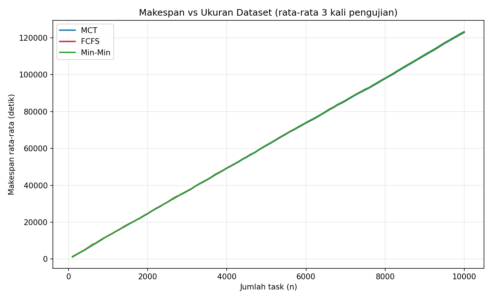
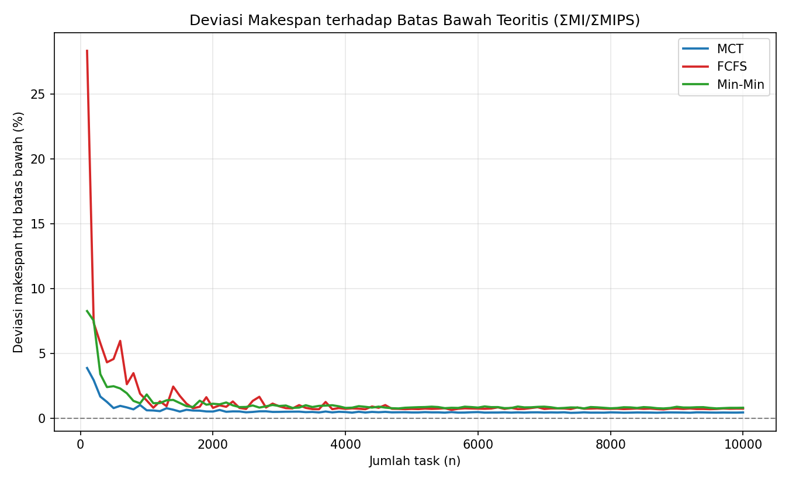
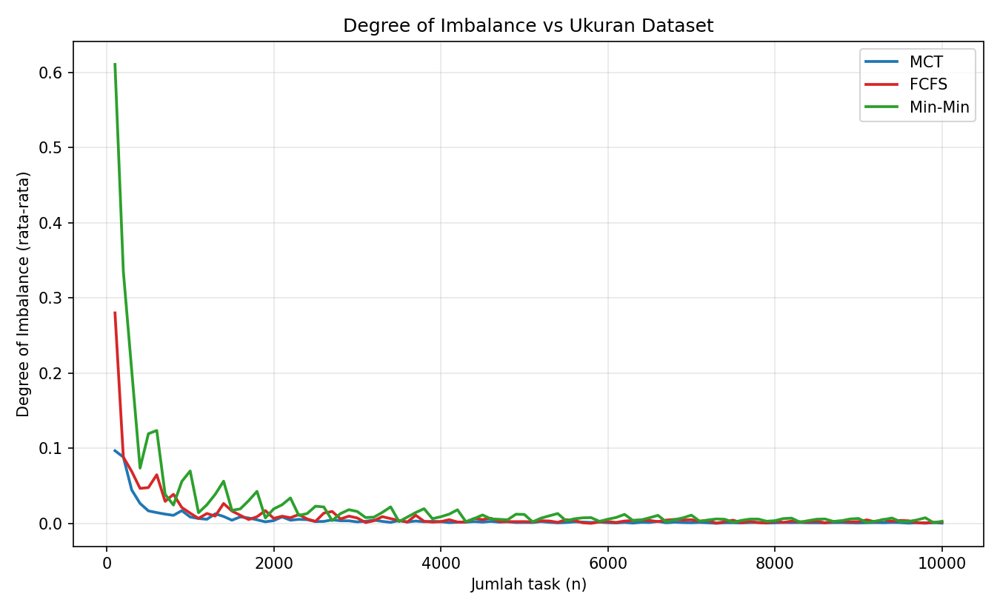
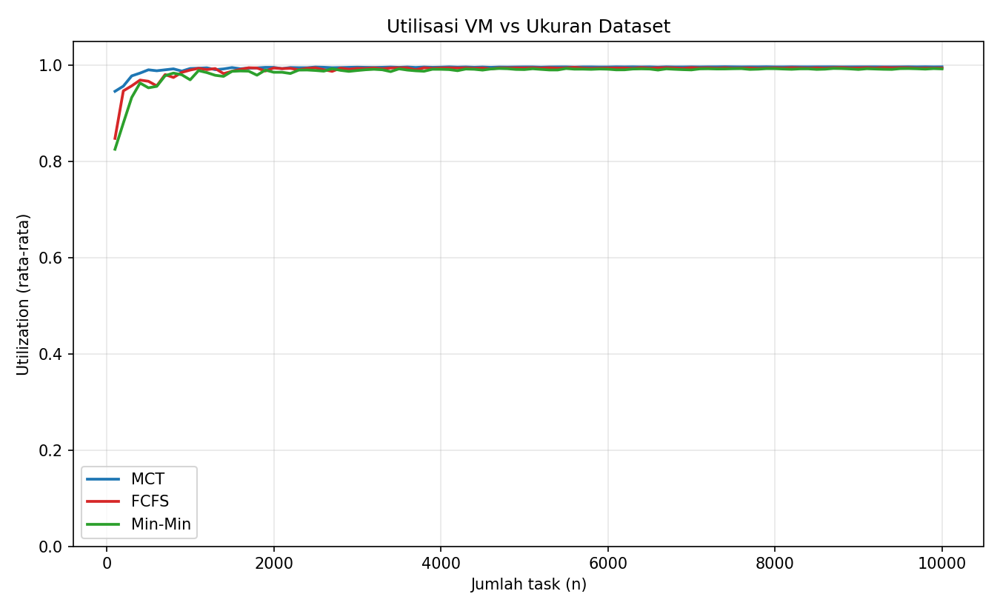

# Uji Coba Skala Dataset — Penjadwalan Task Cloud (MCT, FCFS, Min-Min)

Revisi Tugas MCT (Minggu 4) mata kuliah **SOKA — Strategi Optimasi Komputasi Awan**, Kelompok 2.
Implementasi menggunakan **CloudSim Plus 7.3.0** dengan Java 17.

Revisi ini menjawab tiga catatan dari laporan sebelumnya:

1. **Skala uji coba diperluas**: n = 100 s.d. 10.000 task (kelipatan 100), tiap skala **diulang 3 kali** (dataset sintetis seed 1/2/3), diambil **rata-rata**, lalu dibuat grafik.
2. **Kriteria dataset diatur sendiri**: dataset sintetis dibangkitkan sendiri (3 seed), bukan hanya GoCJ.
3. **Alokasi VM ke host dieksplisitkan**: topologi tetap 2 host sesuai draft design Minggu 3, tetapi penempatan keempat VM dibuat deterministik (semua ke Host 0) lewat kebijakan alokasi yang dipasang eksplisit, **tidak diserahkan ke kebijakan default CloudSim**.

---

## 1. Anggota Kelompok

| No | Nama                              | NRP        |
|----|-----------------------------------|------------|
| 1  | Revalina Erica Permatasari        | 5027241007 |
| 2  | Clarissa Aydin Rahmazea           | 5027241014 |
| 3  | Muhammad Afrizan Rasya            | 5027241048 |
| 4  | Angga Firmansyah                  | 5027241062 |
| 5  | Jofanka Al-kautsar Pangestu Abady | 5027241107 |

---

## 2. Perubahan dari Versi Sebelumnya (Catatan Revisi)

| # | Revisi diminta | Sebelumnya | Sekarang |
|---|----------------|------------|----------|
| 1 | Uji coba 100–10.000 task (kelipatan 100), 3 kali pengujian, rata-rata, dimasukkan ke grafik | Hanya 1.000 task, 1 run per algoritma | 100 skala × 3 seed × 3 algoritma = **900 run**; rata-rata per skala digrafikkan (`chart_*.png`) |
| 2 | Kriteria dataset diatur sendiri | GoCJ bawaan | Dataset **sintetis dibangkitkan sendiri** dari kriteria yang didefinisikan sendiri (3 kelas beban, proporsi & rentang MI ditentukan tim), reproducible lewat `SyntheticDatasetGenerator.java` |
| 3 | 1 host diisi 4 VM, jangan random; jangan diserahkan ke CloudSim langsung | 2 host, penempatan VM diserahkan ke `DatacenterSimple` (kebijakan default bawaan; draft §3.1) | **2 host identik** (8 PE × 100.000 MIPS, sesuai draft Tabel 3–4) dengan `VmAllocationPolicyFirstFit` dipasang **eksplisit**: keempat VM selalu mendarat di Host 0, Host 1 cadangan. Merevisi draft §3.1 |
| 4 | Kode lengkap + step-by-step | — | Bab 6 dan 7 dokumen ini |
| 5 | **Koreksi internal:** rumus *Degree of Imbalance* | Rata-rata *finish time* seluruh cloudlet dibagi jumlah VM → DI antar-algoritma nyaris identik (tidak informatif) | DI dihitung dari **total waktu sibuk per VM** (`ready[]`), mengikuti definisi `(max Tj − min Tj) / mean Tj` — lihat §5 |

Selain itu, dari daftar keterbatasan versi sebelumnya yang kini terjawab:

- Skenario ukuran dataset bervariasi (n = 100 ... 10.000) **sudah dijalankan**.
- Variansi antar-run (repeat) **sudah diukur** (mean ± std, lihat `summary.csv`).

---

## 3. Arsitektur Simulasi

Mengikuti Draft Design Project (Tugas Minggu 3):

| Entitas | Jumlah | Spesifikasi |
|---|---|---|
| Datacenter | 1 | `DatacenterSimple` dengan `VmAllocationPolicyFirstFit` dipasang **eksplisit** |
| Host | **2** (identik) | 8 PE × 100.000 MIPS, RAM 32.000 MB, BW 1.000.000 Mbps — kapasitas jauh melampaui kebutuhan 4 VM |
| VM | 4 | Small 1.000 / Medium 2.500 / Large 5.000 / XLarge 7.500 MIPS — 1 PE, RAM 4.096 MB, `CloudletSchedulerSpaceShared` |
| Cloudlet | 100–10.000 | 1 PE per task, `UtilizationModelDynamic(1.0)` |

### 3.1 Alokasi VM ke Host (revisi poin 3)

Draft Design §3.1 semula membiarkan penempatan VM ke host pada kebijakan default CloudSim Plus.
Sesuai catatan dosen ("1 host diisi 4 VM, tidak random, jangan diserahkan ke CloudSim langsung"),
bagian itu direvisi. Topologi **tetap 2 Host identik** seperti Tabel 3–4 draft; yang berubah
adalah cara penempatannya:

- `DatacenterSimple` dibangun dengan kebijakan alokasi yang dipasang eksplisit:
  `new DatacenterSimple(simulation, hostList, new VmAllocationPolicyFirstFit())`. First-Fit
  menempatkan tiap VM ke host pertama (urutan Host 0, lalu Host 1) yang masih muat.
- Host 0 menyediakan 8 PE, sedangkan keempat VM masing-masing hanya butuh 1 PE dan RAM 4.096 MB,
  sehingga keempat VM **selalu** mendarat di Host 0 — deterministik, tanpa unsur acak.
  Host 1 menjadi cadangan.
- Penempatan dibuktikan, bukan diasumsikan: single-run mencetak `[ALOKASI] VM i -> Host j`,
  dan `BatchRunner` mencetak `[PERINGATAN]` bila ada VM yang tidak mendarat di Host 0.
- Kapasitas host (8 PE × 100.000 MIPS) jauh melampaui kebutuhan VM (total 16.000 MIPS), jadi
  penempatan tidak memengaruhi makespan. Mapping task→VM dihitung di layer aplikasi (§3.2).

### 3.2 Algoritma yang dibandingkan

| Algoritma | Aturan pemilihan | Kompleksitas |
|---|---|---|
| **MCT** (utama) | Tiap task (sesuai urutan kedatangan) diassign ke VM dengan *completion time* paling awal: `CT(i,j) = ready(j) + length(i)/MIPS(j)` | `O(n·m)` |
| FCFS (baseline) | Tiap task diassign ke VM dengan *ready time* paling awal, tanpa melihat panjang task | `~O(n)` |
| Min-Min (pembanding) | Dari semua task tersisa, pasangan (task, VM) dengan CT global terkecil dikerjakan duluan; diulang hingga habis | `O(n²·m)` |

Penjadwalan ketiganya dihitung **di luar event engine CloudSim** (layer aplikasi), lalu hasil
mapping task→VM diserahkan ke simulator untuk eksekusi — pemisahan yang sama dengan versi
sebelumnya, sehingga hasil 1.000 task lama tetap konsisten.

---

## 4. Dataset Sintetis

Dataset **dibangkitkan sendiri** lewat `SyntheticDatasetGenerator.java` (bukan meniru statistik
GoCJ), supaya kriteria beban bisa dijelaskan dan hasilnya reproducible.

### 4.1 Kriteria dataset (diatur sendiri)

Beban kerja dimodelkan **tri-modal (right-skewed)**: mayoritas task pendek, sebagian menengah,
dan ekor panjang yang jarang — meniru pola umum beban cloud, tetapi parameter angkanya kami
tentukan sendiri:

| Kelas beban | Proporsi | Rentang panjang (MI) | Rata-rata kelas (MI) |
|---|---|---|---|
| **Short** | 70% | 10.000 – 150.000 | 80.000 |
| **Medium** | 20% | 200.000 – 450.000 | 325.000 |
| **Long** | 10% | 500.000 – 1.000.000 | 750.000 |

- Panjang task di tiap kelas **uniform integer** di dalam rentangnya.
- Rata-rata dataset ≈ **193.000 – 198.000 MI/task**; kelas Short/Medium/Long tidak saling
  tumpang tindih rentangnya.
- **Reproducible**: `java.util.Random` dengan seed eksplisit **1 / 2 / 3**, sehingga dataset
  yang sama selalu dihasilkan ulang (deterministik).

Angka min/median/mean dataset ini **berbeda jelas** dari GoCJ asli (GoCJ: 15.000 / 89.000 /
121.815 MI), jadi bukan resample dari GoCJ.

**Alasan pemilihan kriteria.** Proporsi 70/20/10 dipilih agar mayoritas task pendek dan hanya
sedikit task panjang (condong ke kanan / *right-skewed*), sejalan dengan rencana dataset sintetis
right-skewed pada Draft Design §2.2. Rentang antar-kelas sengaja diberi celah (150.000–200.000
dan 450.000–500.000 MI) supaya ketiga kelas terpisah jelas dan tidak tumpang tindih.

### 4.2 File

| File | Isi |
|---|---|
| `Dataset-Sintetik/synthetic_seed1.csv` | 10.000 task (seed 1) |
| `Dataset-Sintetik/synthetic_seed2.csv` | 10.000 task (seed 2) |
| `Dataset-Sintetik/synthetic_seed3.csv` | 10.000 task (seed 3) |

- Format: `taskId,lengthMI` (panjang task dalam Million Instructions).
- Untuk skala n, kode mengambil **n baris pertama** dari file seed terpilih.
- Repetisi ke-1 memakai seed1, ke-2 seed2, ke-3 seed3 → rata-rata dari 3 seed
  mengurangi bias urutan task pada satu dataset.

### 4.3 Batas bawah teoritis makespan

Makespan tidak mungkin di bawah `ΣMI / ΣMIPS`. Untuk n = 10.000 (seed1):
ΣMI = 1.923.618.731, ΣMIPS = 16.000 → **batas bawah = 120.226,17 detik**.
(Rata-rata 3 seed: ΣMI = 1.957.122.198 → batas bawah ≈ 122.320,14 detik.)

---

## 5. Metrik

| Metrik | Rumus |
|---|---|
| **Makespan** | `max_j F(j)` — waktu selesai VM terakhir |
| **Degree of Imbalance (DI)** | `(max_j Tj − min_j Tj) / mean_j Tj`, dengan `Tj` = total waktu **sibuk** VM j |
| **Utilization** | `Σ busy time semua VM / (m × makespan)` |
| **Throughput** | `jumlah task / makespan` |

> **Catatan koreksi DI:** versi awal salah memakai rata-rata *finish time* seluruh cloudlet
> dibagi jumlah VM, sehingga DI MCT/FCFS/Min-Min nyaris identik (contoh lama: ketiganya
> 0,0082 di n=1.000). Karena semua task tiba di t=0, `Tj` = ready time akhir VM j, yang
> sudah tersimpan di array `ready[]` hasil penjadwalan. Setelah koreksi, DI antar-algoritma
> terpisah dengan benar (n=1.000: MCT 0,0087 / FCFS 0,0139 / Min-Min 0,0699).

---

## 6. Kode Lengkap

Struktur folder `SOKA_v2`:

```
SOKA_v2/
├── SyntheticDatasetGenerator.java  # generator dataset sintetis (kriteria §4.1, reproducible)
├── BatchRunner.java      # kode lengkap: 2 host, 4 VM + 3 algoritma + sweep 900 run
├── cp.txt                # classpath dependency (dipakai compile & run)
├── plot_results.py       # grafik + summary.csv (mean ± std per skala)
├── Dataset-Sintetik/     # synthetic_seed1..3.csv (10.000 task tiap file)
├── results.csv           # 900 baris hasil mentah (3 algoritma × 100 skala × 3 repetisi)
├── summary.csv           # rata-rata ± std per (algoritma, n)
├── chart_makespan.png    # grafik utama: makespan vs n
├── chart_makespan_diff.png  # zoom selisih antar algoritma (thd MCT)
├── chart_imbalance.png   # degree of imbalance vs n
├── chart_utilization.png # utilization vs n
└── out/                  # hasil compile .class
```

Kode sumber:

- `SyntheticDatasetGenerator.java`: membangkitkan 3 file dataset (seed 1/2/3) sesuai kriteria
  §4.1. Jalankan dengan `java -cp out SyntheticDatasetGenerator` (default: folder
  `Dataset-Sintetik`, 10.000 task, 3 seed).
- `BatchRunner.java`:
  - Konfigurasi topologi: `HOST_MIPS/HOST_PES/...` dan `VM_MIPS = {1000, 2500, 5000, 7500}`.
  - `buildRunPlan()`: daftar (n, seed) untuk seluruh sweep — n kelipatan 100 hingga 10.000, 3 repetisi.
  - `runOnce(algo, n, csvFile)`: membangun 1 Datacenter + **2 Host**, submit 4 VM (ditempatkan First-Fit ke Host 0), baca n task,
    hitung mapping sesuai algoritma, jalankan simulasi, hitung 4 metrik, kembalikan 1 baris CSV.
  - `fcfsAssign / mctAssign / minMinAssign`: implementasi ketiga algoritma (Min-Min dioptimasi
    dengan array boolean agar praktis untuk n = 10.000).
  - `readCsv()`: pembaca dataset sintetis (kolom `lengthMI`).

---

## 7. Cara Menjalankan (Step by Step)

### Prasyarat

- **JDK 17** (di meski ini: `D:\JDK-17`). CloudSim Plus 7.3.0 butuh Java 11+, tapi konsisten
  dengan project lama gunakan 17.
- **Python 3 + matplotlib** untuk grafik: `pip install matplotlib`.
- Tidak wajib ada Maven — dependensi CloudSim Plus sudah tersedia di repositori lokal
  (`~/.m2/repository/org/cloudsimplus/cloudsim-plus/7.3.0/`).
- **Tidak perlu Eclipse/IDE lain** — cukup VS Code terminal, karena tidak ada GUI.

### Langkah 1 — Compile

Buka terminal VS Code (`Ctrl+` `) di folder `SOKA_v2`, lalu:

```powershell
$cp = Get-Content cp.txt -Raw
& "D:\JDK-17\bin\javac.exe" -cp $cp -d out SyntheticDatasetGenerator.java BatchRunner.java
```

### Langkah 2a — (Opsional) Bangkitkan ulang dataset sintetis

Dataset sudah tersedia di `Dataset-Sintetik/`. Untuk membangkitkan ulang dari kriteria §4.1
(hasil deterministik, sama persis):

```powershell
& "D:\JDK-17\bin\java.exe" -cp out SyntheticDatasetGenerator "Dataset-Sintetik" 10000 3
```

### Langkah 2 — Jalankan sweep (900 run, ± 15 menit)

```powershell
& "D:\JDK-17\bin\java.exe" -Xss128m -cp "out;$cp" BatchRunner
```

- Default: membaca folder `Dataset-Sintetik` di dalam `SOKA_v2` (yang sudah berisi
  `synthetic_seed1..3.csv`) dan menulis `results.csv`.
- Jika ingin override: `BatchRunner "<folder-dataset>" "<file-output>"`.

### Langkah 3 — Buat grafik dan ringkasan

```powershell
python plot_results.py
```

Output: `chart_makespan.png`, `chart_makespan_diff.png`, `chart_imbalance.png`,
`chart_utilization.png`, dan `summary.csv`.

### Langkah 4 — (Opsional) Maven

Jika ingin memakai Maven seperti project lama, cukup salin `BatchRunner.java` ke
`src/main/java/` project lama dan jalankan:

```bash
mvn compile
mvn exec:java -Dexec.mainClass="BatchRunner"
```

---

## 8. Hasil Uji Coba

900 run (3 algoritma × 100 skala × 3 repetisi), seluruh cloudlet berstatus **SUCCESS**.

### 8.1 Grafik utama









### 8.2 Tabel ringkasan (rata-rata 3 seed)

| n | MCT | FCFS | Min-Min | Batas bawah |
|---|---|---|---|---|
| 100 | **1.142,90** | 1.410,53 | 1.191,15 | 1.100,20 |
| 1.000 | **12.585,59** | 12.680,02 | 12.738,59 | 12.507,34 |
| 5.000 | **61.574,75** | 61.743,07 | 61.811,19 | 61.290,77 |
| 10.000 | **122.886,38** | 123.245,80 | 123.330,43 | 122.320,14* |

(makespan, detik, rata-rata 3 seed; tabel lengkap mean ± std ada di `summary.csv`)

\* batas bawah rata-rata 3 seed; per seed dihitung dari ΣMI masing-masing dataset.

### 8.3 Analisis

1. **MCT terbaik pada rata-rata 3 seed di seluruh 100 skala.** Rata-rata, FCFS 0,83% lebih
   lambat dan Min-Min 0,55% lebih lambat dari MCT. Pada run individual (300 run), MCT terendah
   di 296 run; 4 run lainnya dimenangkan FCFS (n=200 rep 3, n=400 rep 2, n=1.300 rep 2) atau
   Min-Min (n=900 rep 2).

2. **Ketiga algoritma mendekati batas bawah teoritis.** Deviasi makespan
   terhadap ΣMI/ΣMIPS (chart `chart_makespan_diff.png`) membaik seiring n:
   MCT 3,89% → 0,46%, FCFS 28,35% → 0,76%, Min-Min 8,28% → 0,83% (dari n=100
   ke n=10.000). Rata-rata deviasi: MCT **0,59%**, FCFS 1,43%, Min-Min 1,14%.
   MCT selalu paling dekat dengan batas bawah di seluruh rentang n.

3. **Deviasi kecil di n besar bukan kebetulan.** Dengan beban total jauh
   melebihi kapasitas (utilization ≈ 99%), pembagian beban greedy konvergen ke
   solusi nyaris optimal; sisa deviasi <1% berasal dari fragmentasi terakhir
   (task terbesar di tiap VM) dan jeda event bawaan CloudSim Plus.

4. **DI turun drastis dengan n, dan kini membedakan algoritma.** Rata-rata seluruh skala:
   MCT **0,0056** < FCFS 0,0115 < Min-Min 0,0259. Pada rata-rata 3 seed, DI MCT paling rendah
   di 84 dari 100 skala (FCFS 13, Min-Min 3), jadi MCT paling seimbang secara umum, bukan di
   setiap skala. DI MCT turun dari 0,0968 (n=100) ke 0,0006
   (n=10.000); makin banyak task, makin halus pembagian beban antar VM.

5. **Utilization.** MCT 99,5% > FCFS 99,1% > Min-Min 98,6% (rata-rata seluruh skala).
   Min-Min lebih rendah terutama pada n kecil (n=100 ≈ 82,6%) karena cenderung
   menumpuk task kecil ke VM tercepat sehingga VM lain menganggur di awal run.

6. **Variansi antar seed.** Std makespan MCT pada n=10.000 ±1.833,68 s (1,49% dari mean);
   pada n besar rata-rata 3 repetisi stabil dan peringkat antar-algoritma konsisten.
   Variansi lebih besar di n kecil karena subset awal tiap seed punya komposisi kelas
   beban yang lebih "acak".

### 8.4 Perbandingan dengan hasil lama (n = 1.000, GoCJ)

| Algoritma | GoCJ (versi lama) | Dataset sintetis (baru, n=1.000) |
|---|---|---|
| MCT | 7.690,06 | 12.585,59 |
| FCFS | 7.724,00 | 12.680,02 |
| Min-Min | 7.781,37 | 12.738,59 |

Urutan pada n=1.000 sama (MCT < FCFS < Min-Min). Nilai absolut berbeda karena dataset dan
total beban berbeda (GoCJ ≈ 121.815 MI/task; sintetis ≈ 196.000 MI/task) — bukan
karena perubahan logika simulasi. Urutan FCFS vs Min-Min **tidak konsisten di semua skala**:
pada rata-rata 3 seed FCFS lebih cepat di 77 dari 100 skala, sedangkan Min-Min lebih cepat di
23 skala (12 di antaranya pada n ≤ 1.600; mis. n=100: Min-Min 1.191,15 vs FCFS 1.410,53).

---

## 9. Keterbatasan

- Dataset masih di-truncate dari 10.000 task pertama per seed; skala kecil (n<1.000)
  memakai subset awal, sehingga karakter beban tiap n tidak identik (terlihat pada
  std yang lebih besar di n=500).
- Penjadwalan offline: semua task dianggap tiba di t=0.
- Estimasi waktu eksekusi diasumsikan akurat (ET = length/MIPS), tanpa noise runtime.
- Total cost belum dimodelkan.

---

## 10. Referensi

- Calheiros, R.N., et al. (2011). *CloudSim: A toolkit for modeling and simulation of cloud computing environments*. Software: Practice and Experience, 41(1), 23–50.
- Silva Filho, M.C., et al. (2017). *CloudSim Plus: A cloud computing simulation framework pursuing software engineering principles*. IFIP/IEEE IM, Lisbon.
- Braun, T.D., et al. (2001). *A comparison of eleven static heuristics for mapping a class of independent tasks onto heterogeneous distributed computing systems*. JPDC, 61(6), 810–837.
- Hussain, A., Aleem, M. (2018). *GoCJ: Google Cloud Jobs Dataset*. Data, 3(4), 38.
